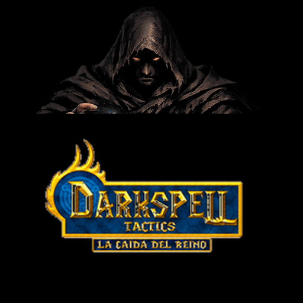

[README.md](https://github.com/user-attachments/files/30382766/README.md)

# 🃏 Darkspell Tactics
### La Caída del Reino

*"El verdadero poder no viene de la magia. Viene de qué estás dispuesto a perder."*

### 👉 [**Jugar ahora**](https://mattosti.github.io/Darkspell/) 👈

---

## 📖 Sobre este proyecto

Darkspell nació de una curiosidad muy simple: **¿se puede hacer un juego completo, jugable de verdad, casi por completo con IA?**

No soy programador de oficio. Este proyecto es el resultado de ir probando, iterando y aprendiendo sobre la marcha junto a un asistente de IA (Claude, de Anthropic) — desde el motor del juego hasta el arte de las cartas, la historia de los cuatro mundos y el multijugador en tiempo real. Cada sistema que ves acá (el tablero, las reglas de elementos y terreno, la tienda, los logros, el chat entre jugadores) se armó de a poco, mucho más como un proceso de aprendizaje que como un plan prolijo desde el día uno.

Lo comparto porque me divertí muchísimo haciéndolo, y ojalá se diviertan jugándolo tanto como yo armándolo. Si tenés **comentarios, ideas, bugs, o simplemente algo que te gustaría ver** (una carta, un duelista, un ajuste de balance), **son más que bienvenidos** — abrí un issue en este repo o escribime directamente. Este proyecto sigue creciendo.

---

## 🎮 Qué es Darkspell

Un juego de cartas de fantasía oscura, estilo *Triple Triad*: colocás cartas en un tablero de 3x3 y capturás las del rival según su poder y el elemento del terreno donde caen. Simple de entender, con bastante profundidad para explorar.

- **149 cartas** de ★1 a ★5 legendarias, repartidas en 4 elementos (🔥 fuego, ⚡ tormenta, 🌿 naturaleza, 🌀 vacío) — más un grupo de cartas **neutrales**, inmunes al terreno.
- **34 duelistas** distribuidos en **4 mundos**, cada uno con su propia historia contada en cinemáticas entre castillo y castillo: Aetherion, el Reino Invertido, el Vacío Eterno y el Abismo Sin Nombre.
- **Multijugador online real** (no simulado): crear sala o unirse con un código, duelo 1v1, chat de texto en vivo, intercambio de cartas, revancha directa y botón de rendirse — todo entre dos navegadores conectados de verdad.
- Sistema de energía, logros, sobres de cartas en la tienda, avatares desbloqueables y una pantalla de reglas para quien llega sin saber nada del género.
- El progreso se guarda solo, en el propio navegador — no hace falta cuenta ni conexión para jugar en solitario.

## 🛠 Cómo está hecho

- **HTML + CSS + JavaScript puro**, sin frameworks ni paso de compilación. El juego entero corre abriendo un archivo, o desde el link de GitHub Pages de arriba.
- El multijugador usa **PeerJS** (WebRTC) para la conexión directa entre los dos jugadores.
- Todo el arte —cartas, retratos, íconos, ilustraciones— también se generó y ajustó con asistencia de IA.

## 💬 ¿Tenés una idea o encontraste un bug?

Este es un proyecto abierto a sugerencias. Si jugás y algo no te cierra, tenés una idea para una carta o un mundo nuevo, o encontrás algo roto, contámelo — abrí un [issue](../../issues) en este repositorio o escribime directamente. Toda devolución ayuda a que esto siga mejorando.

Gracias por pasar a jugar. ¡Que lo disfrutes! 🔥
